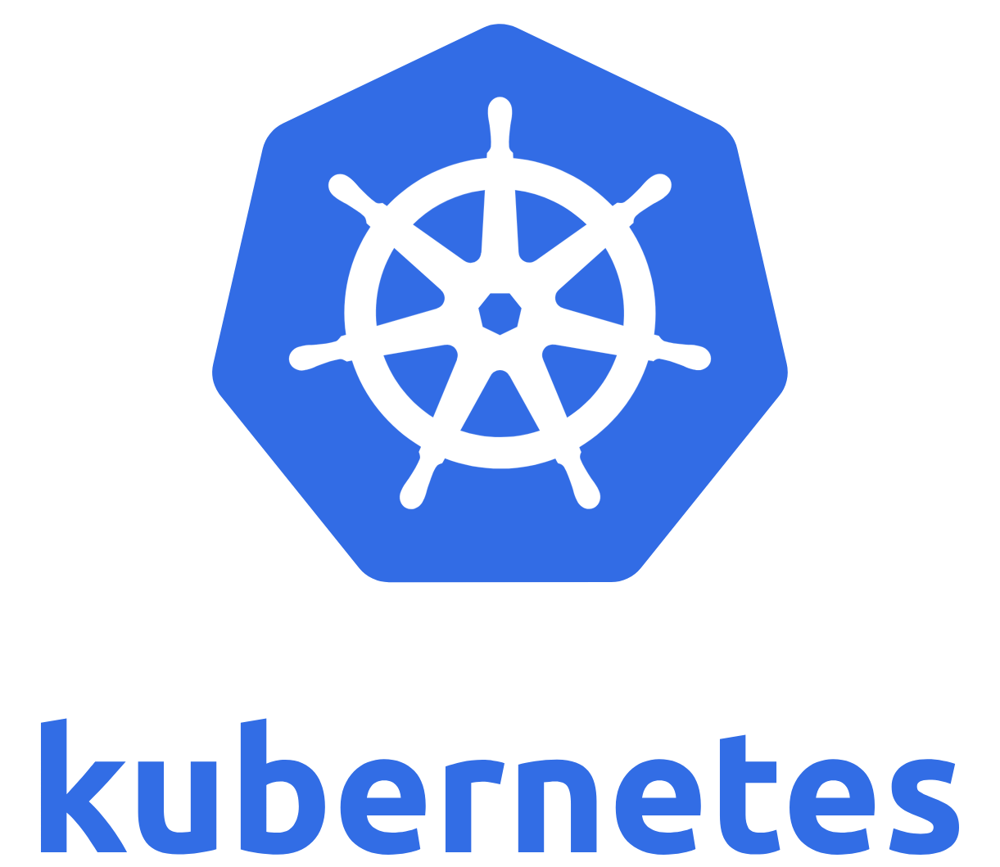
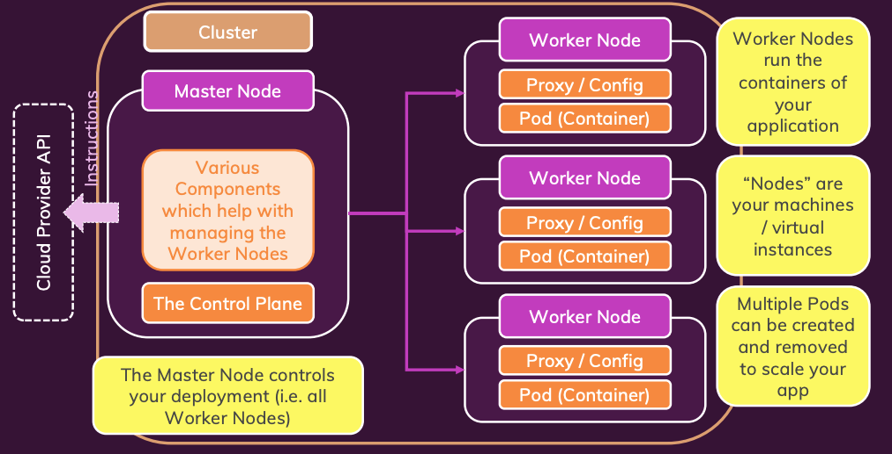
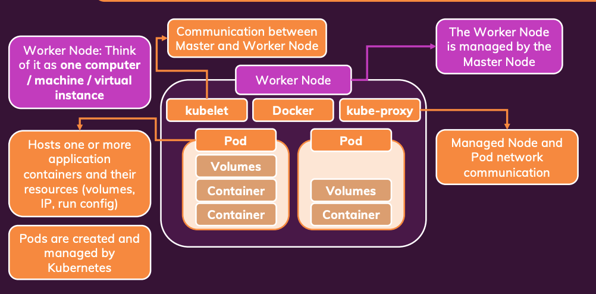
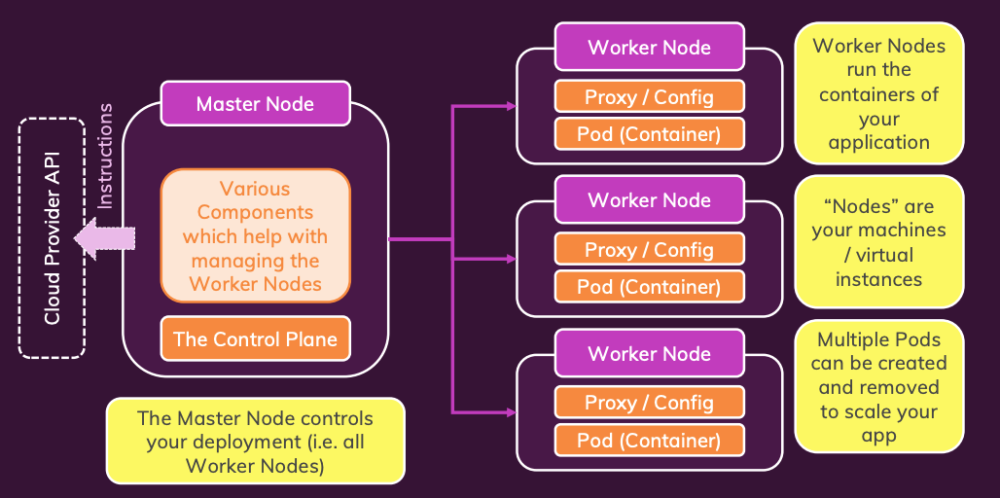

# Introduction to Kubernetes (K8s)
<p align="center">
  
</p>


**Kubernetes (K8s)** is an open-source system for automating the deployment, scaling, and management of containerized applications.  
Think of Kubernetes as a more powerful, production-ready alternative to Docker Compose—but designed for managing containers across multiple machines (nodes).


## 🚨 Challenges of Manual Deployment

Manual container deployment has several drawbacks:

- **High maintenance & error-prone**
  - Containers can crash or go down and need to be restarted or replaced.
  - Scaling during high traffic requires manual intervention.
  - Traffic must be load-balanced across multiple container instances.

- **Security and Configuration Complexity**
  - Managing access, secrets, and networking securely becomes difficult.

- **Vendor Lock-in**
  - Even if we use managed services like AWS ECS, we get locked into a specific cloud provider.

---

## 🚀 Kubernetes to the Rescue

Kubernetes helps solve these issues by offering:

- ✅ **Automated Deployment**
- ✅ **Auto-Scaling and Load Balancing**
- ✅ **Self-Healing Container Management**
- ✅ **Declarative Configuration via YAML Files**
- ✅ **Cloud-Agnostic Deployment**

You define your *desired state* (number of containers, configuration, networking, etc.), and Kubernetes continuously works to maintain that state.

---

## 📦 What Kubernetes *Is* and *Is Not*

| Misconception | Reality |
|---------------|---------|
| "K8s is a cloud service" | ❌ Kubernetes is **not** a cloud service. It’s an open-source project. |
| "K8s only works on cloud" | ❌ Kubernetes can run on **any infrastructure** (cloud, on-premise, hybrid). |
| "K8s is an alternative to Docker" | ❌ Kubernetes **uses** Docker (or other container runtimes) to run containers. |
| "K8s is software I install on one machine" | ❌ It’s a **distributed system** composed of many components and nodes. |

---

## 🧠 Key Concepts & Architecture

### ⚙️ Core Components

- **Pod**: The smallest deployable unit in Kubernetes. It can contain one or more tightly coupled containers.
- **Worker Node**: Runs the Pods.
- **Master Node**: Manages the cluster and controls the scheduling and deployment of Pods.
- **Control Plane**: The set of components that manage the overall cluster state and orchestration logic.

<p align="center">
  
</p>

---

## 🖥️ Worker Node

- **Pod**: Runs application containers and manages storage, IPs, configs, etc.
- **Docker**: Used by Pods to run containers.
- **kubelet**: Communicates with the Master Node.
- **kube-proxy**: Manages network traffic to/from the node.

<p align="center">
  
</p>

---

## 🧠 Master Node

- **API Server**: Exposes the Kubernetes API to external users and internal components.
- **Scheduler**: Assigns Pods to Worker Nodes based on resource availability.
- **Controller Manager**: Maintains the cluster state (e.g., desired number of pods).
- **Cloud Controller Manager**: Integrates with cloud-specific APIs (if running in the cloud).

<p align="center">
  
</p>

---

## 📄 Sample Kubernetes Configuration File

Here’s a minimal example of a Kubernetes Pod configuration using a Deployment:

```yaml
apiVersion: apps/v1
kind: Deployment
metadata:
  name: my-app
spec:
  replicas: 3
  selector:
    matchLabels:
      app: my-app
  template:
    metadata:
      labels:
        app: my-app
    spec:
      containers:
      - name: my-container
        image: nginx:latest
        ports:
        - containerPort: 80
```

This configuration tells Kubernetes:
- Run 3 replicas of an `nginx` container.
- Group them under the label `app: my-app`.
- Expose container port 80.

---

## ✅ Summary

Kubernetes is a powerful tool for deploying and managing containerized applications at scale. It abstracts the complexity of infrastructure and allows developers to focus on writing and running applications, not managing servers.

> 🔧 "You tell Kubernetes *what* you want, and it figures out *how* to make it happen."
